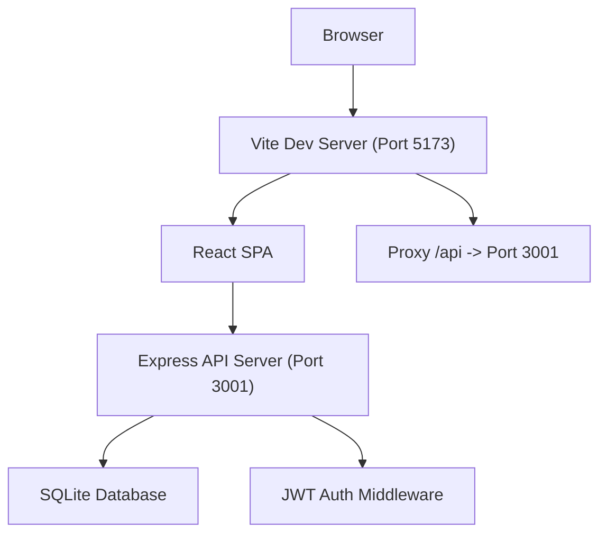

# MAS 官方网站 - 技术设计文档

Feature Name: mas-official-website
Updated: 2026-07-26

## Description

MAS 官方网站是一个前后端分离的 Web 应用，前端使用 React 18 + Vite 构建暗色机密档案风格的用户界面，后端使用 Express.js 提供 RESTful API，数据存储使用 SQLite 数据库。系统包含公开展示区和后台管理区两个模块。

## Architecture



前端 Vite 开发服务器（端口 5173）配置反向代理将 `/api` 请求转发至后端 Express 服务器（端口 3001）。后端通过 `better-sqlite3` 库操作 SQLite 数据库文件。

## Project Structure

```
/workspace/
├── client/                    # React 前端
│   ├── src/
│   │   ├── components/        # 可复用组件
│   │   │   ├── Layout.tsx     # 全局布局（导航栏、页脚）
│   │   │   ├── Navbar.tsx     # 导航栏
│   │   │   ├── AnomalyCard.tsx # 异常项目卡片
│   │   │   └── Pagination.tsx # 分页组件
│   │   ├── pages/
│   │   │   ├── Home.tsx       # 首页
│   │   │   ├── Anomalies.tsx  # 异常档案列表
│   │   │   ├── AnomalyDetail.tsx # 异常项目详情
│   │   │   ├── Login.tsx      # 管理员登录
│   │   │   ├── Dashboard.tsx  # 后台仪表盘
│   │   │   ├── AdminAnomalies.tsx # 异常项目管理列表
│   │   │   └── AnomalyForm.tsx # 创建/编辑异常项目表单
│   │   ├── api/
│   │   │   └── index.ts       # API 请求封装
│   │   ├── types/
│   │   │   └── index.ts       # TypeScript 类型定义
│   │   ├── App.tsx            # 路由配置
│   │   ├── main.tsx           # 入口文件
│   │   └── index.css          # 全局样式
│   ├── index.html
│   ├── vite.config.ts
│   └── package.json
├── server/                    # Express 后端
│   ├── src/
│   │   ├── routes/
│   │   │   ├── anomalies.ts   # 异常项目 API 路由
│   │   │   ├── auth.ts        # 认证 API 路由
│   │   │   └── stats.ts       # 统计 API 路由
│   │   ├── models/
│   │   │   └── database.ts    # SQLite 数据库初始化与操作
│   │   ├── middleware/
│   │   │   └── auth.ts        # JWT 认证中间件
│   │   └── index.ts           # Express 服务入口
│   ├── package.json
│   └── tsconfig.json
├── start.sh                   # 启动脚本
└── package.json               # 根 package.json
```

## Components and Interfaces

### API Endpoints

| Method | Path | Auth | Description |
|--------|------|------|-------------|
| GET | `/api/anomalies` | No | 获取异常项目列表（支持 `page`、`limit`、`class`、`search` 查询参数） |
| GET | `/api/anomalies/:id` | No | 获取单个异常项目详情 |
| POST | `/api/anomalies` | Yes | 创建异常项目 |
| PUT | `/api/anomalies/:id` | Yes | 更新异常项目 |
| DELETE | `/api/anomalies/:id` | Yes | 删除异常项目 |
| POST | `/api/auth/login` | No | 管理员登录，返回 JWT token |
| GET | `/api/stats` | Yes | 获取统计概览数据 |

### 请求/响应格式

**GET /api/anomalies 查询参数:**

```json
{
  "page": 1,
  "limit": 12,
  "class": "Keter",
  "search": "MAS-001"
}
```

**异常项目 JSON 结构:**

```json
{
  "id": 1,
  "item_number": "MAS-001",
  "title": "异常项目标题",
  "class": "Euclid",
  "description": "详细描述...",
  "containment_procedures": "收容措施...",
  "created_at": "2026-07-26T00:00:00.000Z",
  "updated_at": "2026-07-26T00:00:00.000Z"
}
```

### Frontend Routes

| Path | Component | Description |
|------|-----------|-------------|
| `/` | Home | 首页 |
| `/anomalies` | Anomalies | 异常档案列表 |
| `/anomalies/:id` | AnomalyDetail | 异常项目详情 |
| `/admin/login` | Login | 管理员登录 |
| `/admin` | Dashboard | 后台仪表盘 |
| `/admin/anomalies` | AdminAnomalies | 异常项目管理 |
| `/admin/anomalies/new` | AnomalyForm | 新建异常项目 |
| `/admin/anomalies/:id/edit` | AnomalyForm | 编辑异常项目 |

## Data Models

### SQLite Schema

```sql
CREATE TABLE IF NOT EXISTS users (
  id INTEGER PRIMARY KEY AUTOINCREMENT,
  username TEXT UNIQUE NOT NULL,
  password_hash TEXT NOT NULL,
  created_at DATETIME DEFAULT CURRENT_TIMESTAMP
);

CREATE TABLE IF NOT EXISTS anomalies (
  id INTEGER PRIMARY KEY AUTOINCREMENT,
  item_number TEXT UNIQUE NOT NULL,
  title TEXT NOT NULL,
  class TEXT NOT NULL CHECK(class IN ('Safe', 'Euclid', 'Keter', 'Thaumiel', 'Apollyon', 'Neutralized')),
  description TEXT NOT NULL,
  containment_procedures TEXT NOT NULL,
  created_at DATETIME DEFAULT CURRENT_TIMESTAMP,
  updated_at DATETIME DEFAULT CURRENT_TIMESTAMP
);
```

### 项目等级说明

| 等级 | 含义 |
|------|------|
| Safe | 易于安全收容的异常项目 |
| Euclid | 需要更多资源收容或收容不完全可靠的异常项目 |
| Keter | 极难持续安全收容的异常项目 |
| Thaumiel | 用于收容或对抗其他异常项目的异常项目 |
| Apollyon | 无法收容、可能终结世界的异常项目 |
| Neutralized | 已被摧毁或失去异常特性的项目 |

## Correctness Properties

- 异常项目的 `item_number` 字段全局唯一
- 所有必填字段（项目编号、标题、等级、描述、收容措施）在创建和更新时进行服务端验证
- 删除操作需在数据库层面执行，前端仅发送删除请求
- JWT token 过期后的请求返回 401，前端自动跳转登录页
- 分页参数 `page` 和 `limit` 有默认值和范围保护

## Error Handling

| 场景 | HTTP 状态码 | 响应体 |
|------|------------|--------|
| 用户名或密码错误 | 401 | `{"error": "用户名或密码错误"}` |
| 未提供认证 token | 401 | `{"error": "未提供认证凭据"}` |
| token 无效或过期 | 401 | `{"error": "认证凭据无效或已过期"}` |
| 缺少必填字段 | 400 | `{"error": "请填写所有必填字段"}` |
| 项目编号已存在 | 409 | `{"error": "项目编号已存在"}` |
| 异常项目不存在 | 404 | `{"error": "异常项目未找到"}` |
| 服务器内部错误 | 500 | `{"error": "服务器内部错误"}` |

## Test Strategy

- 后端 API 使用 `supertest` 进行集成测试
- 前端使用手动验证，确保页面渲染和交互功能正常
- 测试覆盖：API 端点 CRUD 操作、认证流程、分页查询、筛选功能

## References

[^1]: Vite 反向代理配置 - 参考 `.ai-ready/rules/frontend-reverse-proxy.md`
[^2]: SQLite with better-sqlite3 - https://github.com/WiseLibs/better-sqlite3
